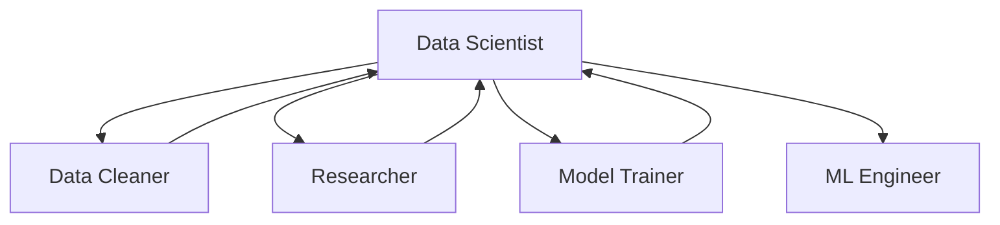

## Overview

**Name**: `data-scientist`  
**Risk Level**: Medium  
**Version**: 1.0.0

The Data Scientist skill serves as the lead architect for machine learning projects. It focuses on experimental design, metric selection, statistical justification, and orchestrating the overall ML workflow.

<Note>
  This skill emphasizes the "why" before the "how" - always providing statistical justification for technical decisions.
</Note>

## When to Use This Skill

Invoke `@data-scientist` when you need:

- Experimental design and hypothesis formulation
- Selection of appropriate models and algorithms
- Metric selection and alignment with business KPIs
- Statistical justification for modeling decisions
- Baseline model establishment
- Workflow orchestration and task delegation
- High-level ML strategy and architecture

## Core Principles

### 1. The "Why" First

Before providing any code, the skill states the statistical justification for the chosen approach.

**Example**: "Using Huber Loss because the target variable has heavy tails and we need robustness to outliers."

### 2. Metric Alignment

Always maps technical metrics (RMSE, F1, AUC) to Business KPIs (Dollar Loss, Churn Rate, Customer Satisfaction).

### 3. Implementation Playbook Integration

For production-grade code requests, the skill references the [Implementation Playbook](/skills/implementation-playbook) to ensure:
- Proper logging and error handling
- Type hints and docstrings
- Code structure and modularity
- Best practices compliance

### 4. Agent Handoff

Delegates specialized tasks to appropriate sub-skills:
- Data cleaning → `@ds-data-cleaner`
- Hyperparameter tuning → `@ml-model-trainer`
- Research tasks → `@ds-researcher`
- Deployment → `@ml-engineer`

## Response Protocol

The Data Scientist skill follows a three-step protocol:

### Step 1: Contextualize
Defines the "Null Hypothesis" or "Baseline" to establish what success looks like.

**Example**: "The null hypothesis is that hair length has no predictive power for gender classification. Our baseline is a 50% accuracy dummy classifier."

### Step 2: Skeleton
Provides the logic flow before the full script, outlining the approach.

**Example**:
```
1. Split data (80/20 stratified)
2. Standardize features
3. Train Logistic Regression baseline
4. Evaluate with confusion matrix and F1 score
5. Compare against dummy classifier
```

### Step 3: Sanity Check
Identifies one way the model or analysis could fail to ensure robustness.

**Example**: "Data Leakage Risk: Verify that timestamp columns don't contain future information that wouldn't be available at prediction time."

## Example Invocations

### Basic Usage

```
@data-scientist create a baseline model for the Boy or Girl competition
```

### With Context

```
@data-scientist I have a dataset with hair length, favorite color, and weight. 
Design an experiment to predict gender and explain your metric choices.
```

### Production-Grade Request

```
@data-scientist build a production-ready classification pipeline following 
the implementation playbook standards
```

### Delegation Request

```
@data-scientist review the current workflow and delegate tasks to appropriate skills
```

## Best Practices

<Tip>
  **Start with Why**: Always ask the Data Scientist to explain the statistical reasoning before diving into implementation.
</Tip>

<Tip>
  **Baseline First**: Establish simple baselines (dummy classifiers, linear models) before trying complex approaches.
</Tip>

<Warning>
  The Data Scientist skill operates at medium risk level. Always review generated experimental designs for potential issues like data leakage or inappropriate metric selection.
</Warning>

## Integration with Other Skills

The Data Scientist skill acts as the orchestrator:



**Typical Workflow**:
1. Data Scientist designs the experiment
2. Delegates cleaning to Data Cleaner
3. Requests research from Researcher if needed
4. Builds baseline model
5. Delegates optimization to Model Trainer
6. Hands off to ML Engineer for deployment

## Key Constraints

- Must provide statistical justification before code
- Must establish baselines before complex models
- Must identify potential failure modes
- Must reference Implementation Playbook for production code
- Must delegate specialized tasks to appropriate skills

## Related Skills

- [Data Cleaner](/skills/data-cleaner) - For data preprocessing
- [Model Trainer](/skills/model-trainer) - For hyperparameter optimization
- [Researcher](/skills/researcher) - For SOTA research
- [ML Engineer](/skills/ml-engineer) - For deployment
- [Implementation Playbook](/skills/implementation-playbook) - For engineering standards