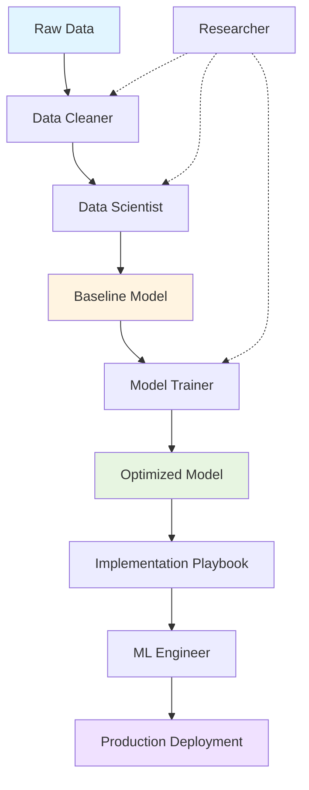
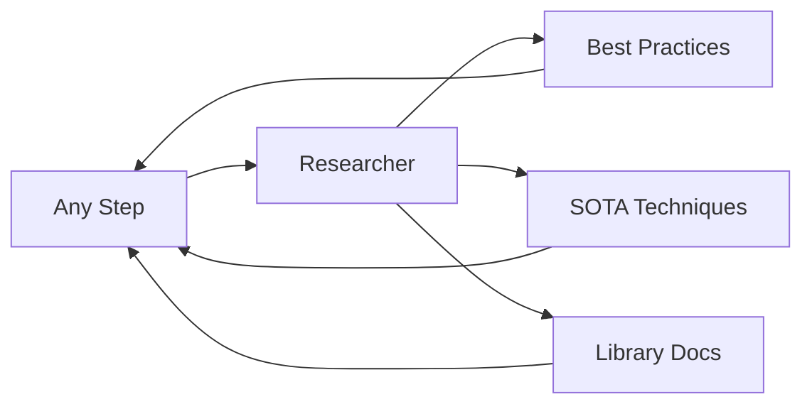

## Overview

The Model Pipeline demonstrates how to orchestrate multiple skills together to build a complete machine learning solution from raw data to production-ready model.

<Note>
  This workflow shows the **ideal sequence** for a typical ML project. Adapt it based on your specific needs.
</Note>

## End-to-End ML Pipeline

Here's the complete workflow for the Boy or Girl Predictor project:



## Step-by-Step Workflow

### Step 1: Data Audit

**Skill**: `@ds-data-cleaner`  
**Input**: `data/raw/train.csv`  
**Output**: Data quality report, cleaning strategy

```
@ds-data-cleaner audit data/raw/train.csv for outliers and missing values
```

**What Happens**:
- Generates `df.info()` and `df.describe()` summary
- Identifies missing values and their patterns
- Detects outliers using IQR method
- Produces visualizations (missing value heatmap, distributions)
- Recommends cleaning strategy

**Deliverables**:
- `reports/data_audit.txt` - Summary statistics
- `reports/missing_values.png` - Visualization
- `reports/outliers.txt` - Outlier analysis

<Tip>
  Review the audit report before proceeding. Understanding your data quality issues is critical for making good cleaning decisions.
</Tip>

### Step 2: Data Preprocessing

**Skill**: `@ds-data-cleaner`  
**Input**: Audit results, `data/raw/train.csv`  
**Output**: `data/processed/train_cleaned.parquet`

```
@ds-data-cleaner implement the recommended cleaning strategy and save to data/processed/
```

**What Happens**:
- Handles missing values (median/mean/mode based on distribution)
- Treats outliers (Winsorization or log-transform)
- Standardizes column names to snake_case
- Converts data types (dates to datetime64)
- Adds validation assertions
- Saves cleaned data without overwriting raw data

**Deliverables**:
- `data/processed/train_cleaned.parquet` - Cleaned dataset
- `src/data/clean.py` - Reusable cleaning script
- `reports/cleaning_log.txt` - Documentation of changes

### Step 3: Establish Baseline

**Skill**: `@data-scientist`  
**Input**: `data/processed/train_cleaned.parquet`  
**Output**: Baseline model and metrics

```
@data-scientist establish a simple baseline model for gender prediction
```

**What Happens**:
- Defines the null hypothesis (e.g., "random guessing = 50% accuracy")
- Creates a dummy classifier baseline
- Trains a simple model (Logistic Regression or Decision Tree)
- Evaluates with appropriate metrics (F1, Precision, Recall)
- Documents the "minimum acceptable performance"

**Deliverables**:
- `models/baseline_model.pkl` - Trained baseline
- `reports/baseline_metrics.json` - Performance metrics
- `notebooks/01_baseline.ipynb` - Experiment notebook

<Note>
  **Why Baseline Matters**: You need to know if your complex model is actually adding value. If XGBoost only improves F1 from 0.75 to 0.76, is the added complexity worth it?
</Note>

### Step 4: Hyperparameter Optimization

**Skill**: `@ml-model-trainer`  
**Input**: Baseline model, cleaned data  
**Output**: Optimized model

```
@ml-model-trainer tune XGBoost with 50 trials using F1-macro metric
```

**What Happens**:
- Defines hyperparameter search space
- Sets up Optuna study with MedianPruner
- Uses Stratified K-Fold cross-validation
- Runs 50 trials with Bayesian optimization
- Logs all trials to `experiments.csv` or MLflow
- Selects best hyperparameters
- Trains final model with best params

**Deliverables**:
- `models/xgboost_optimized.pkl` - Best model
- `experiments.csv` - All trial results
- `reports/optimization_history.png` - Visualization
- `reports/param_importance.png` - Which params mattered most

<Tip>
  Check the optimization history plot. If the score is still improving after 50 trials, you might want to run more.
</Tip>

### Step 5: Verify Production Standards

**Reference**: `@implementation-playbook`  
**Input**: Optimized model and code  
**Output**: Production-ready code

```
@implementation-playbook verify the model code meets production standards
```

**What Happens**:
- Verifies code passes `black` and `flake8`
- Checks for data leakage
- Confirms model beats baseline
- Ensures proper error handling (no bare except)
- Validates logging (using `logging`, not `print`)
- Checks for type hints and docstrings
- Verifies serialization includes metadata.json
- Confirms reproducibility (seeds, requirements.txt)

**Deliverables**:
- Refactored code meeting standards
- `requirements.txt` - Dependencies
- `models/model_v1_metadata.json` - Model metadata
- Updated docstrings and type hints

### Step 6: Production Deployment

**Skill**: `@ml-engineer`  
**Input**: Production-ready model  
**Output**: Deployed API

```
@ml-engineer create a FastAPI deployment with Docker and monitoring
```

**What Happens**:
- Wraps model in FastAPI with Pydantic validation
- Adds try-except error handling
- Implements `/health` endpoint
- Adds Prometheus metrics (latency, requests, errors)
- Creates Dockerfile and docker-compose.yml
- Sets up logging to file and stdout
- Includes model metadata in API

**Deliverables**:
- `app.py` - FastAPI application
- `Dockerfile` - Container definition
- `docker-compose.yml` - Easy deployment
- `models/` - Model files in container
- Documentation on API endpoints

<Warning>
  Test the API locally with `docker-compose up` before deploying to production.
</Warning>

## Optional: Research Integration

**Skill**: `@ds-researcher`

At any point in the pipeline, invoke the Researcher skill:



**Example Uses**:

- **Before Step 2**: "@ds-researcher what are best practices for handling missing data in tabular classification?"
- **Before Step 3**: "@ds-researcher what metrics should I use for imbalanced binary classification?"
- **Before Step 4**: "@ds-researcher what are typical XGBoost hyperparameter ranges for binary classification?"
- **Before Step 6**: "@ds-researcher what's the current best practice for model serving - FastAPI vs Flask?"

## Complete Example Sequence

Here's a full conversation flow:

```
User: I need to build a model for the Boy or Girl competition

@ds-data-cleaner audit data/raw/train.csv

[Reviews audit results]

@ds-data-cleaner implement the cleaning strategy, save to data/processed/

@data-scientist create a baseline logistic regression model

[Reviews baseline: F1 = 0.65]

@ds-researcher what hyperparameters work well for XGBoost on small tabular datasets?

[Gets recommended ranges]

@ml-model-trainer optimize XGBoost using the recommended ranges, 50 trials, F1-macro metric

[Gets optimized model: F1 = 0.78]

@implementation-playbook verify the code meets production standards

[Code is refactored]

@ml-engineer create a FastAPI deployment with Docker

[API is ready]

User: Test the API locally
docker-compose up
curl -X POST http://localhost:8000/predict -d '{...}'

[Success!]
```

## Workflow Variations

### Quick Prototype

For rapid experimentation:

1. `@ds-data-cleaner` - Quick audit
2. `@data-scientist` - Baseline only
3. Skip optimization, go straight to analysis

### Research-Heavy Project

For novel problems:

1. `@ds-researcher` - Extensive literature review
2. `@data-scientist` - Experimental design
3. `@ds-data-cleaner` - Domain-specific cleaning
4. `@data-scientist` - Multiple baselines
5. `@ml-model-trainer` - Optimization

### Production Update

For updating existing models:

1. `@ds-data-cleaner` - Validate new data
2. `@ml-model-trainer` - Re-tune on new data
3. `@implementation-playbook` - Verify standards
4. `@ml-engineer` - Update deployment

## Best Practices

<Tip>
  **Don't Skip Steps**: Each step builds on the previous one. Skipping the baseline or data audit will likely cause problems later.
</Tip>

<Tip>
  **Iterate as Needed**: If Step 4 (optimization) doesn't improve much over Step 3 (baseline), go back and investigate feature engineering.
</Tip>

<Tip>
  **Document Everything**: Each skill should produce artifacts. Keep them organized in `reports/` and `models/` directories.
</Tip>

<Warning>
  **Review Before Production**: Always manually review the code before deploying, especially the data cleaning and model serving components.
</Warning>

## Timeline Estimate

For a small project like Boy or Girl Predictor:

| Step | Estimated Time | Can Parallelize? |
|------|----------------|------------------|
| 1. Data Audit | 15-30 min | No |
| 2. Preprocessing | 30-60 min | No |
| 3. Baseline | 30-60 min | No |
| 4. Optimization | 1-4 hours | Partially (try multiple models) |
| 5. Standards Check | 30 min | No |
| 6. Deployment | 1-2 hours | No |
| **Total** | **4-8 hours** | |

<Note>
  Times are for small datasets (less than 100k rows, less than 50 features). Scale accordingly for larger projects.
</Note>

## Troubleshooting

### Model Not Beating Baseline

1. Check for data leakage in cleaning
2. Review feature engineering
3. Try different model families
4. Ask `@ds-researcher` for domain-specific techniques

### Optimization Taking Too Long

1. Reduce `n_trials` to 20-30
2. Use more aggressive pruning
3. Reduce cross-validation folds (5 → 3)
4. Consider smaller hyperparameter search space

### Deployment Issues

1. Verify model loads correctly in Docker
2. Check all dependencies in requirements.txt
3. Test health endpoint first
4. Review logs for error details

## Related Resources

- [Data Scientist Skill](/skills/data-scientist)
- [Data Cleaner Skill](/skills/data-cleaner)
- [Model Trainer Skill](/skills/model-trainer)
- [ML Engineer Skill](/skills/ml-engineer)
- [Researcher Skill](/skills/researcher)
- [Implementation Playbook](/skills/implementation-playbook)