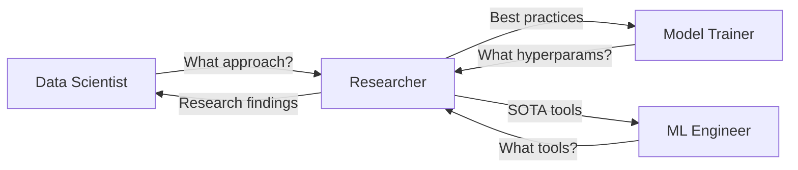

## Overview

**Name**: `ds-researcher`  
**Risk Level**: Unknown  
**Version**: 1.0.0

The Researcher skill specializes in State-of-the-Art (SOTA) research, ArXiv paper summaries, library documentation, and industry best practices. Use this skill to stay current with the latest techniques and find proven approaches to your ML problems.

<Note>
  Risk level is "unknown" because this skill interacts with external resources and web content.
</Note>

## When to Use This Skill

Invoke `@ds-researcher` when you need:

- Latest research papers on specific ML topics
- Current best practices for a problem type
- Library documentation and API references
- Kaggle competition winner strategies
- Comparison of different approaches
- Version information for ML libraries
- "Tricks of the trade" from experts
- Industry benchmarks and baselines

## Core Capabilities

### 1. Library Documentation Research

Use the **Browser tool** to find:
- Most recent stable versions of libraries (XGBoost, PyTorch, Scikit-learn, etc.)
- API documentation and usage examples
- Breaking changes and migration guides
- Best practices from official docs

**Example Query**:
```
@ds-researcher what's the latest stable version of XGBoost and 
what are the new features?
```

### 2. Kaggle Winner Interviews

Search for competition winner write-ups and interviews related to your specific problem type.

**Why This Matters**: Kaggle winners often share:
- Feature engineering tricks
- Ensemble strategies
- Hyperparameter ranges that worked
- Common pitfalls to avoid

**Example Query**:
```
@ds-researcher find Kaggle competition strategies for binary classification 
with tabular data
```

### 3. Gold Standard Comparisons

Compare your current approach against the "Gold Standard" in the industry.

**Example Query**:
```
@ds-researcher what's the current SOTA for image classification on CIFAR-10?
```

### 4. ArXiv Paper Summaries

Find and summarize recent academic papers relevant to your problem.

**Example Query**:
```
@ds-researcher summarize recent papers on handling class imbalance 
in binary classification
```

## Example Invocations

### Basic Research

```
@ds-researcher what are the best practices for handling missing data 
in time series?
```

### Version Check

```
@ds-researcher check if there's a newer version of scikit-learn with 
better support for categorical features
```

### Competition Strategy

```
@ds-researcher find strategies from Kaggle winners on gender prediction 
or demographic classification tasks
```

### Algorithm Comparison

```
@ds-researcher compare XGBoost vs LightGBM vs CatBoost for tabular 
data with categorical features
```

### Specific Technique

```
@ds-researcher what are the latest techniques for feature selection 
in high-dimensional datasets?
```

### Implementation Details

```
@ds-researcher how do top practitioners handle feature scaling - 
standardization vs normalization?
```

## Research Workflow

### Phase 1: Problem Understanding
```
@ds-researcher what are the common approaches to [your problem type]?
```

### Phase 2: Library Selection
```
@ds-researcher which libraries are most commonly used for [task]?
```

### Phase 3: Best Practices
```
@ds-researcher what are the pitfalls to avoid when [implementing technique]?
```

### Phase 4: Benchmarking
```
@ds-researcher what accuracy/performance should I expect for [problem type]?
```

## Integration with Other Skills

The Researcher skill supports other skills:



**Example Collaboration**:
```
@data-scientist suggests using XGBoost
@ds-researcher find optimal hyperparameter ranges for XGBoost on binary classification
@ml-model-trainer use those ranges for optimization
```

## Best Practices

<Tip>
  **Be Specific**: The more specific your research query, the better the results. Instead of "how to do classification", ask "how to handle class imbalance in binary classification with 1:100 ratio".
</Tip>

<Tip>
  **Check Dates**: When researching, pay attention to when information was published. ML moves fast - a 2-year-old best practice might be outdated.
</Tip>

<Tip>
  **Validate Claims**: Not all online content is accurate. Cross-reference important findings from multiple sources.
</Tip>

<Warning>
  External research may not always be applicable to your specific context. Always validate recommendations with your own data.
</Warning>

## Common Research Patterns

### 1. New Project Research

Before starting a project:
```
1. @ds-researcher what's the current SOTA for [problem type]?
2. @ds-researcher what metrics do practitioners use for [problem type]?
3. @ds-researcher what are common pitfalls in [problem type]?
```

### 2. Stuck on Performance

When model performance plateaus:
```
1. @ds-researcher what feature engineering techniques improve [problem type]?
2. @ds-researcher what ensemble methods work well for [problem type]?
3. @ds-researcher what do Kaggle winners do for [problem type]?
```

### 3. Tool Selection

When choosing tools:
```
1. @ds-researcher compare [Library A] vs [Library B] for [use case]
2. @ds-researcher what are the pros/cons of [tool]?
3. @ds-researcher what do industry practitioners use for [task]?
```

## Key Research Sources

The Researcher skill typically consults:

- **Official Documentation**: Library docs, API references
- **Kaggle**: Competition notebooks, winner write-ups, discussions
- **ArXiv**: Academic papers (especially cs.LG and stat.ML)
- **Papers with Code**: Benchmarks and SOTA results
- **GitHub**: Popular implementations and issue discussions
- **Medium/Towards Data Science**: Practitioner tutorials
- **Reddit** (r/MachineLearning, r/datascience): Community discussions

## Example Research Report

A typical research output might look like:

```markdown
## Research: Feature Selection for Tabular Classification

### Current SOTA Approaches:
1. **Recursive Feature Elimination (RFE)** - Scikit-learn implementation
2. **SHAP-based selection** - Select features with highest mean |SHAP value|
3. **Boruta algorithm** - All-relevant feature selection

### Kaggle Winner Strategies:
- Top 3 solutions in [Competition X] used feature importance from tree models
- Common threshold: Keep features with importance > 0.01

### Recommended Approach:
For your tabular binary classification problem, start with:
1. Train XGBoost with all features
2. Use feature_importances_ to rank features
3. Try removing bottom 20% and re-evaluate
4. Use SHAP for final interpretation

### Library Versions:
- XGBoost 2.0.3 (latest stable, released 2024-11)
- SHAP 0.44.1 (latest stable)

### Pitfalls to Avoid:
- Don't do feature selection before train/test split (causes leakage)
- Feature importance can be biased toward high-cardinality features
```

## Key Constraints

- Must use Browser tool for web research
- Should cite sources when providing information
- Should indicate confidence level ("commonly used" vs "emerging technique")
- Should note date relevance for time-sensitive information
- Should cross-reference claims when possible

## Related Skills

- [Data Scientist](/skills/data-scientist) - Uses research to inform strategy
- [Model Trainer](/skills/model-trainer) - Uses research for hyperparameter ranges
- [ML Engineer](/skills/ml-engineer) - Uses research for tool selection
- [Implementation Playbook](/skills/implementation-playbook) - Benefits from industry best practices